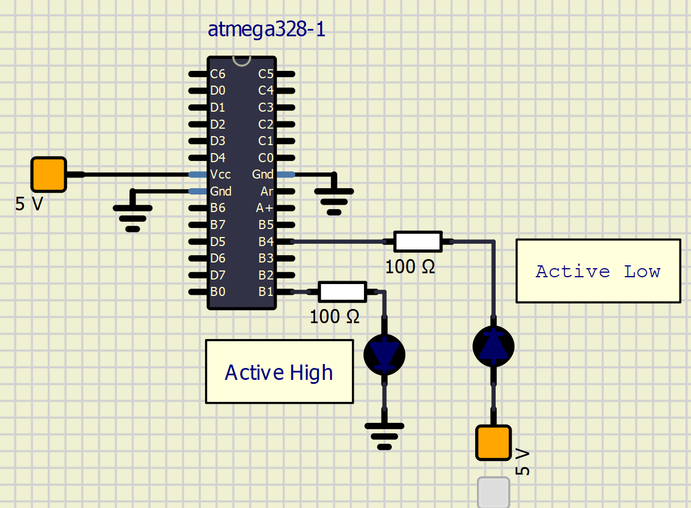
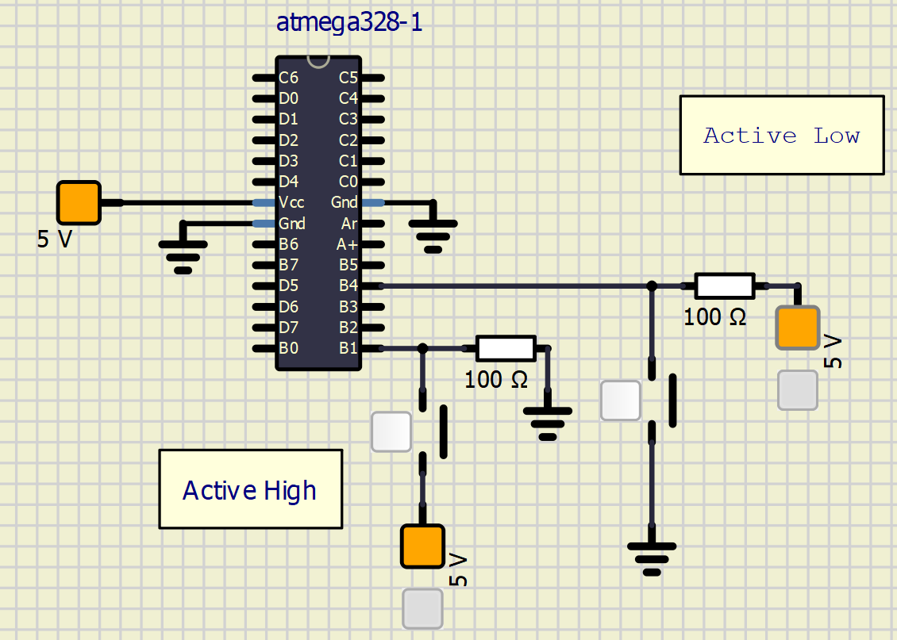

# Lab 2: FILIP KOCUM

[github link of my repository](https://github.com/xkocum00/Digital-electronics-2)
<a name="preparation"></a>
## Preparation tasks (done before the lab at home)

1. Draw two basic ways to connect a LED to the output pin of the microcontroller: LED active-low, LED active-high.



2. [Calculate LED resistor value](https://electronicsclub.info/leds.htm) for typical red and blue LEDs.

&nbsp;
(5-2)/0,02 = 150 Ω
&nbsp;
(5-3)/0,02 = 100 Ω
| **LED color** | **Supply voltage** | **LED current** | **LED voltage** | **Resistor value** |
| :-: | :-: | :-: | :-: | :-: |
| red | 5&nbsp;V | 20&nbsp;mA | 2V | 150 ohm |
| blue | 5&nbsp;V | 20&nbsp;mA | 3V | 100 ohm|

> Note that, equation was generated by [Online LaTeX Equation Editor](https://www.codecogs.com/latex/eqneditor.php) using the following code.
```LaTeX

```
>

3. Draw the basic ways to connect a push button to the microcontroller input pin: button active-low, button active-high.



### Active-low and active-high LEDs

1. Complete tables according to the AVR manual.

| **DDRB** | **Description** |
| :-: | :-- |
| 0 | Input pin |
| 1 | Output pin|

| **PORTB** | **Description** |
| :-: | :-- |
| 0 | Output low value |
| 1 | Output high value |

| **DDRB** | **PORTB** | **Direction** | **Internal pull-up resistor** | **Description** |
| :-: | :-: | :-: | :-: | :-- |
| 0 | 0 | input | no | Tri-state, high-impedance |
| 0 | 1 | input | yes | Pxn will source current if ext. pulled low |
| 1 | 0 | output | no | Output low (sink) |
| 1 | 1 | output | no | Output high (source) |

2. See [schematic of Arduino Uno board](../../Docs/arduino_shield.pdf) in docs folder of Digital-electronics-2 repository and find out which pins of ATmega328P can be used as input/output pins. To which pin is the LED L connected? Is it connected as active-low or active-high? Note that labels on Arduino `~3`, `~5`, etc. do not mean that the signals are inverted; the `~` symbol indicates that a PWM (Pulse-width modulation) signal can be generated on these pins.

| **Port** | **Pin** | **Input/output usage?** |
| :-: | :-: | :-- |
| A | x | Microcontroller ATmega328P does not contain port A |
| B | 0 | Yes Arduino pin D8 |
|   | 1 | Yes Arduino pin D9 |
|   | 2 | Yes Arduino pin D10 |
|   | 3 | Yes Arduino pin D11 |
|   | 4 | Yes Arduino pin D12 |
|   | 5 | Yes Arduino pin D13 |
|   | 6 | No |
|   | 7 | No |
| C | 0 | Yes Arduino pin A0(D14) |
|   | 1 | Yes Arduino pin A1(D15) |
|   | 2 | Yes Arduino pin A2(D16) |
|   | 3 | Yes Arduino pin A3(D17) |
|   | 4 | Yes Arduino pin A4(D18)|
|   | 5 | Yes Arduino pin A5(D19) |
|   | 6 | Yes/Reset |
|   | 7 | No |
| D | 0 | Yes (Arduino pin RX<-D0) |
|   | 1 | Yes (Arduino pin TX<-D1) |
|   | 2 | Yes Arduino pin D2 |
|   | 3 | Yes Arduino pin D3 |
|   | 4 | Yes Arduino pin D4 |
|   | 5 | Yes Arduino pin D5 |
|   | 6 | Yes Arduino pin D6 |
|   | 7 | Yes Arduino pin D7 |

2. Part of the C code listing with syntax highlighting, which blinks alternately with a pair of LEDs; let one LED is connected to port B and the other to port C:

```c
int main(void)
{
    // Green LED at port B
    // Set pin as output in Data Direction Register...
    DDRB = DDRB | (1<<LED_GREEN);
    // ...and turn LED off in Data Register
    PORTB = PORTB & ~(1<<LED_GREEN);

    // Configure the second LED at port C
    // WRITE YOUR CODE HERE

    // Infinite loop
    while (1)
    {
        // Pause several milliseconds
        _delay_ms(BLINK_DELAY);

        // WRITE YOUR CODE HERE
    }

    // Will never reach this
    return 0;
}
```


### Push button

1. Part of the C code listing with syntax highlighting, which toggles LEDs only if push button is pressed. Otherwise, the value of the LEDs does not change. Let the push button is connected to port D:

```c
    // Configure Push button at port D and enable internal pull-up resistor
    // WRITE YOUR CODE HERE

    // Infinite loop
    while (1)
    {
        // Pause several milliseconds
        _delay_ms(BLINK_DELAY);

        // WRITE YOUR CODE HERE
    }
```


### Knight Rider

1. Scheme of Knight Rider application, i.e. connection of AVR device, five LEDs, resistors, one push button, and supply voltage. The image can be drawn on a computer or by hand. Always name all components and their values!

   
