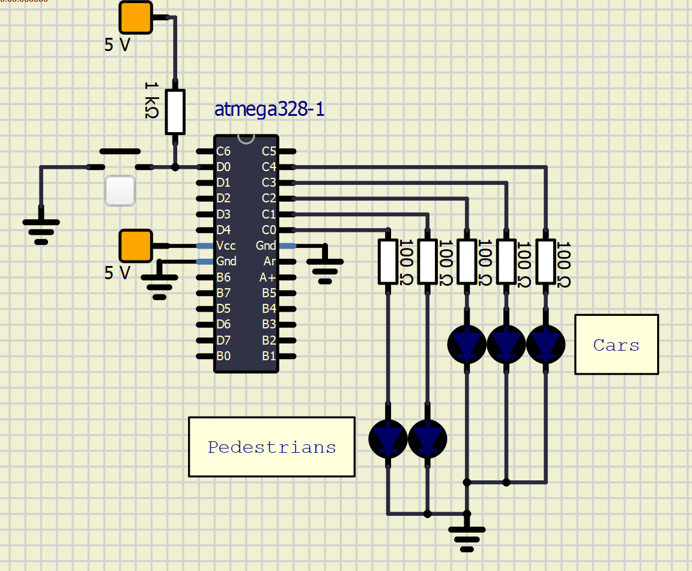

# Lab 3: FILIP KOCUM

[github link of my repository](https://github.com/xkocum00/Digital-electronics-2)


### Data types in C

1. Complete table.

| **Data type** | **Number of bits** | **Range** | **Description** |
| :-: | :-: | :-: | :-- | 
| `uint8_t`  | 8 | 0, 1, ..., 255 | Unsigned 8-bit integer |
| `int8_t`   | 8 | -128 - 127 | Signed 8-bit Integer |
| `uint16_t` | 16 | 0 - 65535 | Unsigned 16-bit integer |
| `int16_t`  | 16 | -32768 - 32767 | Signed 16-bit integer |
| `float`    | 32 | -3.4e+38, ..., 3.4e+38 | Single-precision floating-point |
| `void`     | 0 | 0 | empty data type that has no value |


### GPIO library

1. In your words, describe the difference between the declaration and the definition of the function in C.
   * Function declaration
   
     V dekleraci funkce se určuje jak se bude na venek funkce chovat, určí se zde jméno funkce, vstupní parametry a návratová          hodnota.
     
    * Function definition
    
      Je to část programu, která tvoří funkci.

2. Part of the C code listing with syntax highlighting, which toggles LEDs only if push button is pressed. Otherwise, the value of the LEDs does not change. Use function from your GPIO library. Let the push button is connected to port D:

```c
#define LED_GREEN   PB5     // AVR pin where green LED is connected
#define LED_RED     PC1
#define BUTTON      PD1
#define BLINK_DELAY 500
#ifndef F_CPU
# define F_CPU 16000000     // CPU frequency in Hz required for delay
#endif

/* Includes ----------------------------------------------------------*/
#include <util/delay.h>     // Functions for busy-wait delay loops
#include <avr/io.h>         // AVR device-specific IO definitions
#include "gpio.h"           // GPIO library for AVR-GCC

/* Function definitions ----------------------------------------------*/
/**********************************************************************
 * Function: Main function where the program execution begins
 * Purpose:  Toggle two LEDs when a push button is pressed. Functions 
 *           from user-defined GPIO library is used.
 * Returns:  none
 **********************************************************************/
int main(void)
{
    // Green LED at port B
    GPIO_config_output(&DDRB, LED_GREEN);
    GPIO_write_low(&PORTB, LED_GREEN);

    // Configure the second LED at port C
    GPIO_config_output(&DDRC, LED_RED);
    GPIO_write_low(&PORTC, LED_RED);

    // Configure Push button at port D and enable internal pull-up resistor
    GPIO_config_input_pullup(&DDRD, BUTTON);

    // Infinite loop
    while (1)
    {
        // Pause several milliseconds
        _delay_ms(BLINK_DELAY);

        // WRITE YOUR CODE HERE
        if (GPIO_read(&PIND, BUTTON) == 0) {
            GPIO_toggle(&PORTC, LED_RED);
            GPIO_toggle(&PORTB, LED_GREEN);
        }            
    }

    // Will never reach this
    return 0;
}
```


### Traffic light

1. Scheme of traffic light application with one red/yellow/green light for cars and one red/green light for pedestrians. Connect AVR device, LEDs, resistors, one push button (for pedestrians), and supply voltage. The image can be drawn on a computer or by hand. Always name all components and their values!

   
