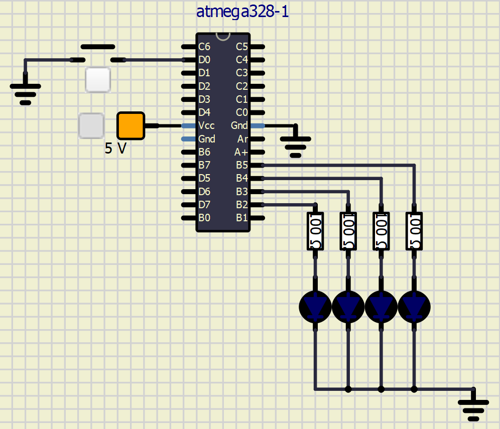

<a name="preparation"></a>
## Preparation tasks (done before the lab at home)

1. Draw two basic ways to connect a LED to the output pin of the microcontroller: LED active-low, LED active-high.

&nbsp;

&nbsp;

&nbsp;

&nbsp;

&nbsp;

&nbsp;

2. [Calculate LED resistor value](https://electronicsclub.info/leds.htm) for typical red and blue LEDs.

&nbsp;

&nbsp;

| **LED color** | **Supply voltage** | **LED current** | **LED voltage** | **Resistor value** |
| :-: | :-: | :-: | :-: | :-: |
| red | 5&nbsp;V | 20&nbsp;mA | 2V | 150 ohm |
| blue | 5&nbsp;V | 20&nbsp;mA | 3V | 100 ohm|

> Note that, equation was generated by [Online LaTeX Equation Editor](https://www.codecogs.com/latex/eqneditor.php) using the following code.
```LaTeX
R = \frac{V_{SUPPLY}-V_{LED}}{I} =
```
>

3. Draw the basic ways to connect a push button to the microcontroller input pin: button active-low, button active-high.



<a name="part1"></a>
| **DDRB** | **Description** |
| :-: | :-- |
| 0 | Input pin |
| 1 | Output pin|

| **PORTB** | **Description** |
| :-: | :-- |
| 0 | Output low value |
| 1 |  |

| **DDRB** | **PORTB** | **Direction** | **Internal pull-up resistor** | **Description** |
| :-: | :-: | :-: | :-: | :-- |
| 0 | 0 | input | no | Tri-state, high-impedance |
| 0 | 1 | | | |
| 1 | 0 | | | |
| 1 | 1 | | | |

See [schematic of Arduino Uno board](../../Docs/arduino_shield.pdf) in docs folder of Digital-electronics-2 repository and find out which pins of ATmega328P can be used as input/output pins. To which pin is the LED L connected? Is it connected as active-low or active-high? Note that labels on Arduino `~3`, `~5`, etc. do not mean that the signals are inverted; the `~` symbol indicates that a PWM (Pulse-width modulation) signal can be generated on these pins.

| **Port** | **Pin** | **Input/output usage?** |
| :-: | :-: | :-- |
| A | x | Microcontroller ATmega328P does not contain port A |
| B | 0 | Yes (Arduino pin 8) |
|   | 1 |  |
|   | 2 |  |
|   | 3 |  |
|   | 4 |  |
|   | 5 |  |
|   | 6 |  |
|   | 7 |  |
| C | 0 | Yes (Arduino pin A0) |
|   | 1 |  |
|   | 2 |  |
|   | 3 |  |
|   | 4 |  |
|   | 5 |  |
|   | 6 |  |
|   | 7 |  |
| D | 0 | Yes (Arduino pin RX<-0) |
|   | 1 |  |
|   | 2 |  |
|   | 3 |  |
|   | 4 |  |
|   | 5 |  |
|   | 6 |  |
|   | 7 |  |

Use breadboard (or SimulIDE real time electronic circuit simulator), connect resistor and second LED to Arduino output pin in active-low way. **Let the second LED is connected to port C.**

